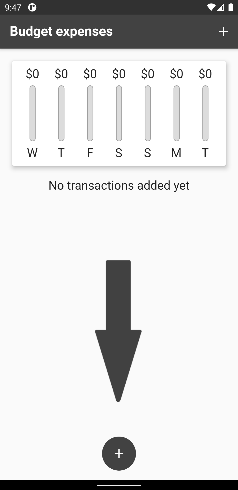
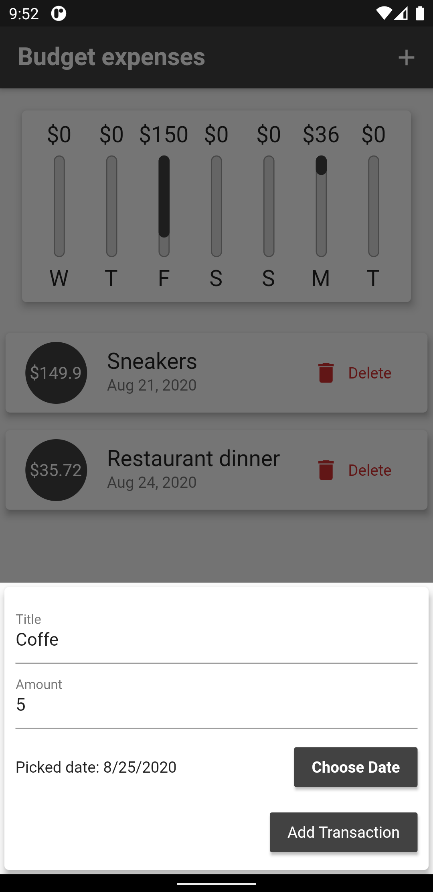
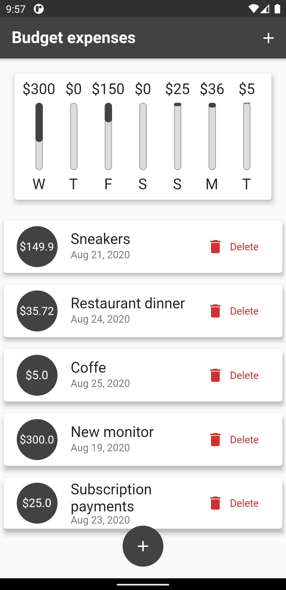

# Cash spendings flutter app

Flutter app for tracking your daily spendings (Without saving after full restart).

You can add spendings by clicking on central bottom button or upper right button. Adding have 3 options: Title, Amount and Date. Without filling in one of the fields, it will not be added in list of spendings. Title can contain only English text. Amount have special keyboard for setting spending. The date picking uses default calendar and changes graphs only for last 7 days.

App works in 2 modes: portrait and landscape.

## Screenshots

|             Main screen         |          Adding screen         |           Filled List           |
|---------------------------------|--------------------------------|---------------------------------|
||||

## Operability

|OS     |Operate|
|-------|-------|
|Android|✔️    |
|iOS    |❓     |

✔️ - Stable

❓ - Not tested

## Special thanks

[Flutter & Dart - The Complete Guide [2020 Edition]](https://www.udemy.com/course/learn-flutter-dart-to-build-ios-android-apps/) - The course I'm studying.
